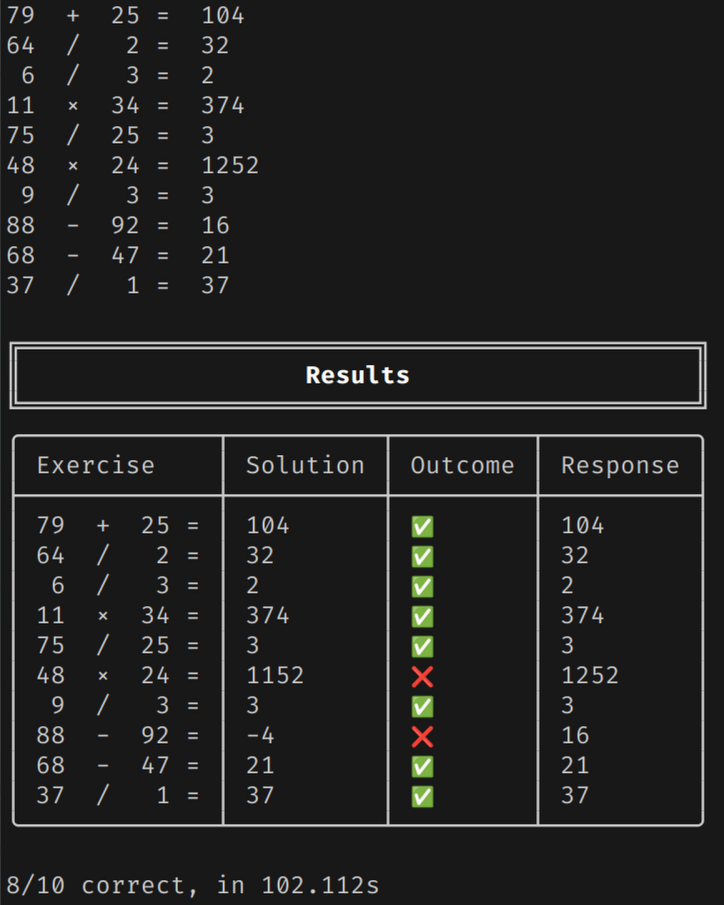

# calCLI

A simple terminal application that gives you a number of randomly generated math exercises and displays your performance.

<p align="center">
  
</p>

## Usage

```
calcli [OPTIONS]

Options:
  -c, --count <COUNT>  Number of excercises [default: 10]
      --min <MIN>      Smallest allowed number in equasions [default: 0]
      --max <MAX>      Largest allowed number in equasions [default: 100]
  -h, --help           Print help
  -V, --version        Print version
```

## Credits

This project was inspired by this video from _Answer in Progress_:

<p align="center">
  <a href="https://www.youtube.com/watch?v=xvOkXXprG2g">
    
  </a>
</p>